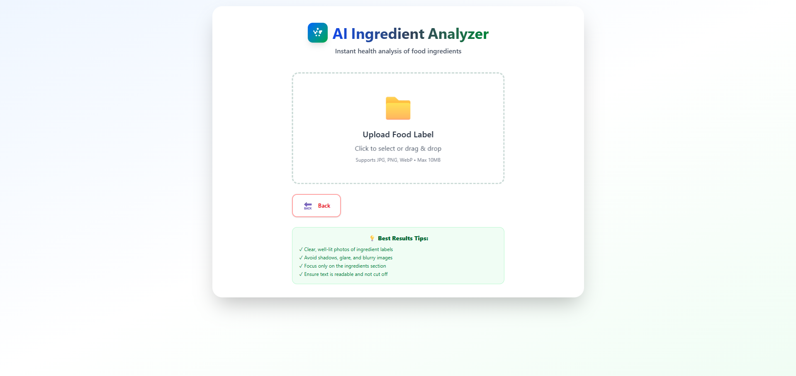
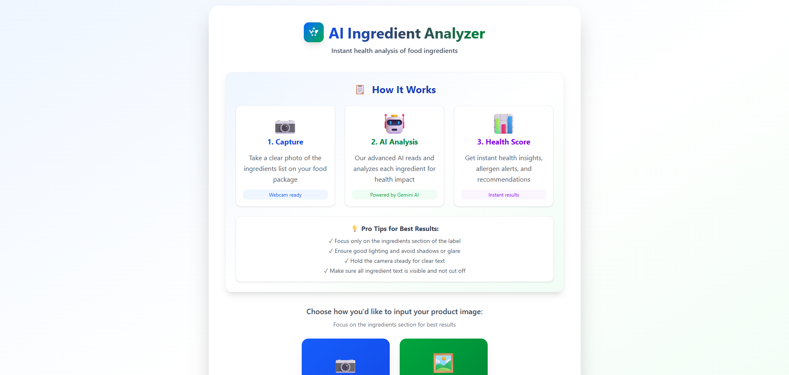

# 🧠 Smart Ingredient Analyzer

[](https://smart-ingredient-analyzer.vercel.app)
[](https://github.com/vipinsao/Smart-Ingredient-Analyzer/stargazers)

## 📊 Problem

Reading food labels is time-consuming and confusing. Most people don't know which ingredients are harmful, beneficial, or potentially allergenic. **Smart Ingredient Analyzer** solves this by instantly analyzing any food label using AI—just snap a photo.

---

## ✅ Solution

An AI-powered web application that:
- **Scans food labels** using your device camera or uploaded images
- **Extracts ingredients** using OCR (Optical Character Recognition) via Tesseract.js
- **Analyzes health impact** using Google's Gemini AI
- **Provides instant insights** on allergens, harmful additives, and nutritional value

Whether you're health-conscious, have food allergies, or just curious—this tool gives you clarity in seconds.

---

## 🛠️ Tech Stack

**Why this stack?**  
Chose Next.js for server-side rendering and optimal performance, TypeScript for type safety, Groq API for fast AI inference, and Tesseract.js for client-side OCR without backend dependencies. This combination ensures speed, scalability, and a seamless user experience.

### Technologies Used:
- **Frontend:** Next.js, React, TypeScript, Tailwind CSS
- **AI/ML:** Groq API, Google Gemini AI
- **OCR:** Tesseract.js for ingredient extraction
- **Deployment:** Vercel

---

## ✨ Features

✅ **Upload or Capture** food label images  
✅ **OCR Extraction** of ingredient lists using Tesseract.js  
✅ **AI-Powered Analysis** via Gemini AI classifying ingredients as:  
   - 🟢 **Good** (beneficial)  
   - 🟡 **Neutral** (safe but not beneficial)  
   - 🔴 **Bad** (harmful or allergenic)  
✅ **Health Insights** with detailed explanations for each ingredient  
✅ **Responsive Design** optimized for mobile and desktop  
✅ **Fast & Accurate** real-time processing

---

## 🚀 How to Run Locally

### Prerequisites
- Node.js 18+ installed
- Groq API key (get yours at [console.groq.com](https://console.groq.com))

### Installation

```bash
# Clone the repository
git clone https://github.com/vipinsao/Smart-Ingredient-Analyzer.git
cd Smart-Ingredient-Analyzer

# Install dependencies
npm install

# Set up environment variables
cp .env.example .env.local
# Add your GROQ_API_KEY to .env.local

# Run the development server
npm run dev
```

Open [http://localhost:3000](http://localhost:3000) in your browser.

---

## 🌐 Live Demo

🔗 **Try it now:** [smart-ingredient-analyzer.vercel.app](https://smart-ingredient-analyzer.vercel.app)

---

## 📸 Screenshots

### Upload Page


### Analysis Dashboard


---

## 📦 Project Structure

```
Smart-Ingredient-Analyzer/
├── front-end/          # Next.js frontend
│   ├── app/
│   ├── components/
│   └── public/
├── back-end/           # Express.js API (if applicable)
└── README.md
```

---

## 👤 Author

**Vipin Chandra Sao**  
📧 [vipinc.sao@gmail.com](mailto:vipinc.sao@gmail.com)  
🔗 [LinkedIn](https://linkedin.com/in/vipinsao) | [Portfolio](https://portfolio-latest-y5jf.vercel.app)

---

## 📝 License

MIT License - feel free to use this project for learning and building!

---

<div align="center">

**⭐ Star this repo if you found it helpful!**

</div>
